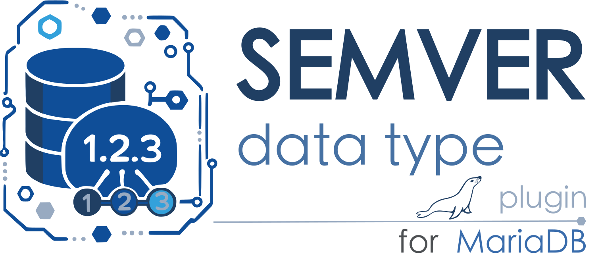

# mariadb-plugin-type-semver

 

A MariaDB Server plugin implementing a
validated [Semantic Versioning 2.0.0](https://semver.org/) data type and
companion native functions.

```sql
MariaDB > INSTALL SONAME 'type_semver';
MariaDB > SELECT plugin_name, plugin_type, plugin_library, plugin_description, plugin_author 
FROM information_schema.PLUGINS WHERE plugin_library LIKE 'type_semver.so';
+-------------------+-------------+----------------+-------------------------------------+---------------+
| plugin_name       | plugin_type | plugin_library | plugin_description                  | plugin_author |
+-------------------+-------------+----------------+-------------------------------------+---------------+
| semver            | DATA TYPE   | type_semver.so | Semantic Versioning 2.0.0 data type | lefred        |
| semver_major      | FUNCTION    | type_semver.so | Return the major version            | lefred        |
| semver_minor      | FUNCTION    | type_semver.so | Return the minor version            | lefred        |
| semver_patch      | FUNCTION    | type_semver.so | Return the patch version            | lefred        |
| semver_prerelease | FUNCTION    | type_semver.so | Return prerelease identifiers       | lefred        |
| semver_build      | FUNCTION    | type_semver.so | Return build metadata               | lefred        |
| semver_is_valid   | FUNCTION    | type_semver.so | Validate a semantic version         | lefred        |
| semver_compare    | FUNCTION    | type_semver.so | Compare semantic version precedence | lefred        |
| semver_satisfies  | FUNCTION    | type_semver.so | Test a semantic version range       | lefred        |
| semver_normalize  | FUNCTION    | type_semver.so | Normalize a semantic version        | lefred        |
| semver_bump_major | FUNCTION    | type_semver.so | Increment the major version         | lefred        |
| semver_bump_minor | FUNCTION    | type_semver.so | Increment the minor version         | lefred        |
| semver_bump_patch | FUNCTION    | type_semver.so | Increment the patch version         | lefred        |
+-------------------+-------------+----------------+-------------------------------------+---------------+
13 rows in set (0.002 sec)
```

Example usage:

```sql 
MariaDB > CREATE TABLE releases (version SEMVER NOT NULL, PRIMARY KEY (version));

MariaDB > INSERT INTO releases VALUES ('1.2.3'), ('2.0.0-rc.1+build.42');
Query OK, 2 rows affected (0.012 sec)
Records: 2  Duplicates: 0  Warnings: 0

MariaDB > INSERT INTO releases VALUES ('1.2,3'), ('a2.0.0-rc');
ERROR 1292 (22007): Incorrect semver value: '1.2,3' for column `test`.`releases`.`version` at row 1
```

Versions have a maximum canonical length of 255 bytes. Major, minor and patch
are unsigned 64-bit values. Values stored in a `SEMVER` column must use strict
SemVer syntax; `SEMVER_NORMALIZE()` additionally accepts surrounding whitespace,
an initial `v`, `V`, or `=`, and missing minor or patch components.
The native binary representation is precedence-sortable, so indexes and
`ORDER BY` use SemVer precedence (with build metadata as a deterministic
tie-breaker between otherwise equal stored values).

## Functions

### `SEMVER_MAJOR()`

Returns the major version number.

```sql
SELECT SEMVER_MAJOR('12.4.7');
-- 12
```

### `SEMVER_MINOR()`

Returns the minor version number.

```sql
SELECT SEMVER_MINOR('12.4.7');
-- 4
```

### `SEMVER_PATCH()`

Returns the patch version number.

```sql
SELECT SEMVER_PATCH('12.4.7');
-- 7
```

### `SEMVER_PRERELEASE()`

Returns the prerelease identifiers without the leading `-`.

```sql
SELECT SEMVER_PRERELEASE('2.0.0-rc.1+build.42');
-- rc.1
```

### `SEMVER_BUILD()`

Returns the build metadata without the leading `+`.

```sql
SELECT SEMVER_BUILD('2.0.0-rc.1+build.42');
-- build.42
```

### `SEMVER_IS_VALID()`

Returns `1` for a strict SemVer 2.0.0 value and `0` for an invalid value.

```sql
SELECT SEMVER_IS_VALID('1.2.3'), SEMVER_IS_VALID('01.2.3');
-- 1, 0
```

### `SEMVER_COMPARE()`

Returns `-1`, `0`, or `1` when the first version has lower, equal, or higher
precedence than the second. Build metadata is ignored.

```sql
SELECT SEMVER_COMPARE('1.0.0-rc.1', '1.0.0');
-- -1
```

### `SEMVER_SATISFIES()`

Returns `1` when a version satisfies the supplied range and `0` otherwise.

```sql
SELECT SEMVER_SATISFIES('1.5.3', '>=1.2.0 <2.0.0');
-- 1
```

Ranges support exact versions, `=`, `<`, `<=`, `>`, `>=`, whitespace-separated
AND comparators, `||` alternatives, caret (`^`), tilde (`~`), and `x`, `X`, or
`*` wildcards. Further examples include `^1.4.2` and `1.2.x`.

### `SEMVER_NORMALIZE()`

Produces a canonical version. It accepts surrounding whitespace, an initial
`v`, `V`, or `=`, and missing minor or patch components.

```sql
SELECT SEMVER_NORMALIZE(' v1.2 ');
-- 1.2.0
```

### `SEMVER_BUMP_MAJOR()`

Increments the major number, resets minor and patch, and removes prerelease and
build metadata.

```sql
SELECT SEMVER_BUMP_MAJOR('1.2.3-rc.1+build.42');
-- 2.0.0
```

### `SEMVER_BUMP_MINOR()`

Increments the minor number, resets patch, and removes prerelease and build
metadata.

```sql
SELECT SEMVER_BUMP_MINOR('1.2.3-rc.1+build.42');
-- 1.3.0
```

### `SEMVER_BUMP_PATCH()`

Increments the patch number and removes prerelease and build metadata.

```sql
SELECT SEMVER_BUMP_PATCH('1.2.3-rc.1+build.42');
-- 1.2.4
```

## Build and test

Place or symlink this directory as `plugin/type_semver` in a MariaDB Server
source tree, enable it in CMake, build `type_semver`, then run:

```sh
cd mysql-test
./mtr --suite=type_semver
```
